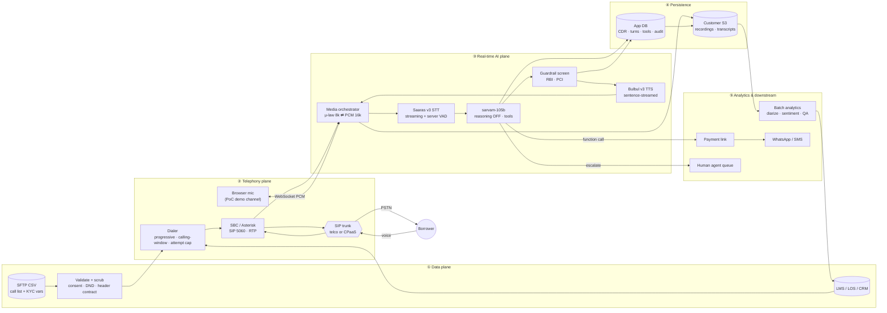
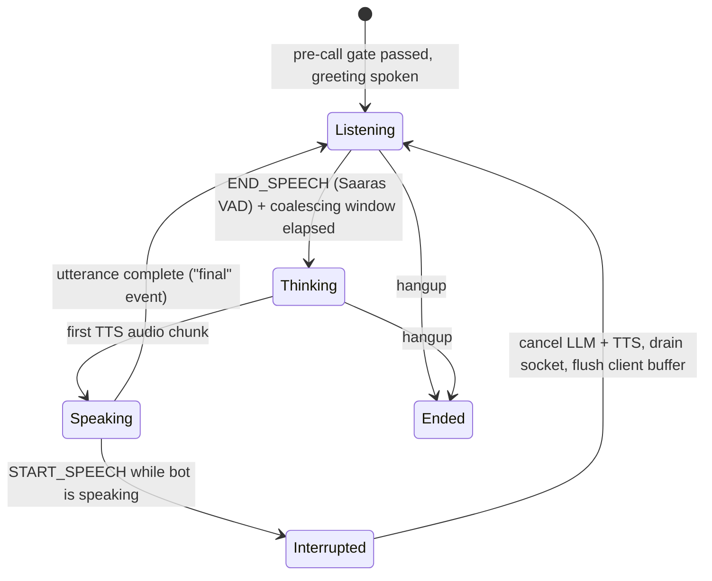
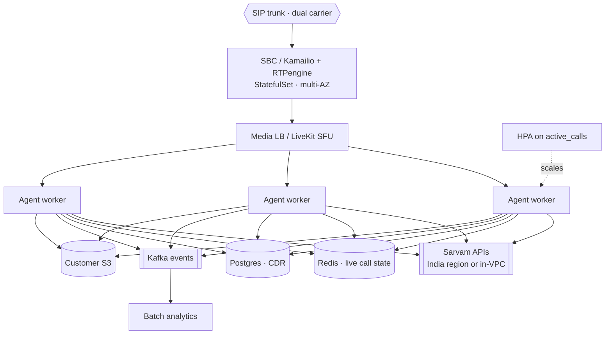

# Architecture

> **Diagram for slides:** an editable, business-readable version of the five-plane
> view is at **[`architecture.excalidraw`](architecture.excalidraw)** — open it at
> <https://excalidraw.com> (File → Open), or via this
> [shareable link](https://excalidraw.com/#json=f6vPpCWlZJ4lcUDH40Ql8,0N2WadOY11SK3FEgDCBFaQ).
> Export to PNG/SVG from there for a deck. The Mermaid diagrams below are the
> canonical, version-controlled source and render directly on GitHub.

## The five planes

Data (who to call, with what context) → Telephony (get a live audio channel) →
Real-time AI (the conversation) → Persistence (records) → Analytics & downstream
(what to do next).



**Read it as a latency budget.** Everything in plane ③ — caller stops speaking →
STT final → LLM tokens → TTS first audio — must land inside ~800 ms or the caller
hears dead air.

---

## The turn state machine



Two rules make it feel human:

1. **Never wait for a whole turn.** LLM tokens are aggregated into *sentences*,
   and sentence 1 goes to TTS while the model is still writing sentence 2. This is
   what turns a ~2.5 s sum-of-stages into ~0.8 s of felt latency.
2. **Cancel instantly on barge-in.** One `asyncio.Event` per turn is checked by
   the LLM consumer, the TTS reader and the audio sink, so an interruption stops
   the bot within a frame or two.

---

## Latency budget — measured, not aspirational

p50 across live calls, read from `calls.latency_stats`:

| Stage | Measured p50 | Target | Notes |
|---|---|---|---|
| STT finalisation | **221 ms** | 50–200 ms | Saaras endpoint → final transcript |
| Coalescing / queue wait | **290 ms** | — | deliberate; see below |
| LLM time-to-first-token | **231 ms** | 200–500 ms | `reasoning_effort=null` |
| TTS time-to-first-audio | **236 ms** | 100–300 ms | socket already open |
| **Pipeline** (admitted → audio) | **537 ms** | ≤600 ms | what we can engineer |
| **End-of-speech → first audio** | **1142 ms** | ≤800 ms | what the caller perceives |

### Why the perceived figure exceeds target, and what I would do next

Two recoverable costs:

* **The 250 ms coalescing window** (`STT_COALESCE_MS`). Saaras emits several
  finals per spoken utterance, so we wait briefly for a follow-on fragment before
  answering. Without it the bot replies to half a sentence. Reducing it to ~150 ms
  is likely safe but needs turn-quality measured over more calls than I have.
* **Saaras finalisation (~220 ms).** The fix is to act on *stable partials*
  instead of waiting for the final — start the LLM on a high-confidence partial
  and cancel if the final disagrees. Not implemented here; it trades a small
  correctness risk for ~200 ms.

### Honesty in the metric

* A turn where the caller stopped talking **while the bot was still speaking** is
  queued behind that playback and cannot meet a response budget. Such turns are
  flagged `overlapped`, **excluded from p50/p95**, and counted separately in
  `turns_overlapped_excluded`.
* Only the **first** sentence of a turn defines that turn's TTFA; later sentences
  overlap with playback and would understate it.
* The dashboard shows `within_budget_pct` per call, not a single flattering mean.

---

## Audio path

Telephony and ASR speak different audio. Getting this wrong degrades recognition
*silently*, which is the worst failure mode.

| Domain | Format | Why |
|---|---|---|
| PSTN / SIP leg | 8 kHz, 8-bit μ-law (G.711), 20 ms frames = 160 B | legacy telecom bandwidth |
| Saaras input | 16 kHz, 16-bit linear PCM, mono | trained on wideband |
| Bulbul output | 22.05 / 24 kHz PCM — **or μ-law @ 8 kHz directly** | synthesis is wideband |

```
inbound   μ-law 8k → PCM 8k → high-pass + AGC → resample 16k → Saaras
outbound  Bulbul mp3 (browser)  |  Bulbul μ-law 8k → RTP (telephony, no transcode)
```

Two notes worth stating in the room:

* **Codec choice is an accuracy decision.** G.729's compression discards spectral
  detail that Indian-language phonemes depend on; insist on **G.711** on the trunk
  where STT quality matters.
* Bulbul's REST endpoint emits **μ-law at 8 kHz natively**, so the telephony path
  needs no transcode on the hot path. The WebSocket is mp3-only, which is why the
  browser demo uses the socket and the carrier leg uses REST.

`audioop` was removed from the stdlib in Python 3.13, so the G.711 codec and
resampler are implemented on numpy in `src/app/audio.py` and unit-tested.

---

## Data model

15 tables. The ones that carry the argument:

| Table | Role |
|---|---|
| `borrowers` | the call universe from the SFTP CSV, with `consent` and `dnd_registered` |
| `calls` | **the CDR** — one row per attempt; `correlation_id` is the SIP `Call-ID` |
| `turns` | one row per utterance, with the per-stage latency that produced it |
| `tool_invocations` | every side effect, with a **UNIQUE `idempotency_key`** |
| `promises_to_pay`, `payment_links`, `escalations` | the commercial outputs |
| `crm_writebacks` | outbox for LMS/CRM — queue, retry, dead-letter, reconcile |
| `analytics_reports` | batch STT + diarization + sentiment + QA score |
| `compliance_events` | every guardrail decision, with the regulation cited |
| `audit_log` | immutable trail, including the vendor-copy purge proof |
| `translation_cache` | one Mayura call per approved string per language |

Design choices that matter:

* **Money is integer paise.** Never float.
* **`tool_invocations.idempotency_key` is UNIQUE.** That constraint — not
  application logic — is what makes "send the payment link exactly once" true when
  the model repeats itself or a client retries.
* **`correlation_id` is UNIQUE** and is the SIP `Call-ID`, so one trace spans
  SIP → media → STT → LLM → TTS → tools → analytics.
* **Portable types.** `JSON().with_variant(JSONB, "postgresql")` — SQLite for the
  PoC, Postgres in production, one `DATABASE_URL` change, no code edits.
* No card/UPI credential is ever stored, or even accepted, which keeps the whole
  platform out of PCI-DSS scope.

---

## Compliance as architecture, not prose

Each regulatory requirement is a control in a specific place:

| Requirement | Control | Where |
|---|---|---|
| Consent before contact (DPDP) | rows without consent are **dropped at ingest**; gate re-checks | `ingest/csv_loader.py`, `guardrails.precall_check` |
| DND scrub (TRAI) | dropped at ingest, re-checked pre-call | same |
| Calling window 08:00–19:00 IST (RBI) | pre-call gate, fails closed | `guardrails.in_calling_window` |
| Max attempts/day (RBI) | counter on `borrowers`, checked pre-call | `guardrails.precall_check` |
| Recording disclosure | **deterministic** opening line, not model-generated | `agent/prompt.opening_line` |
| No threats / harassment (RBI) | every drafted line screened before TTS | `guardrails.screen_utterance` |
| No credential requests (PCI) | same screen; tools cannot accept card data | `guardrails`, `agent/tools.py` |
| No unauthorised waivers | same screen; no such tool exists | `agent/tools.py` |
| Auditability | `compliance_events` + `audit_log` rows per decision | `db/models.py` |

Two deliberate stances:

* **A prompt is an instruction, not a control.** The system prompt states the RBI
  rules *and* a deterministic screen verifies every line independently. If the
  screen blocks a line, a safe substitute is spoken — never silence, which reads
  as a dropped call.
* **The bot cannot do what it was never given.** There is no waiver tool, no
  settlement tool, no tool that accepts a card number. Capability is bounded by
  construction, not by persuasion.

---

## Production topology

The novel scaling axis is **concurrent calls**, not HTTP RPS: each active call
pins a media worker plus STT/LLM/TTS sessions.



* Autoscale on a custom `active_calls` metric (~6 concurrent calls/pod), not CPU.
* Media workers are stateless per call; drain gracefully (`preStop` + long grace
  period) so live calls finish before a pod terminates.
* The SBC is the stateful edge: active-standby or clustered, multi-AZ, dual
  carriers.
* Deploy in an India region (Mumbai/Hyderabad) for residency **and** latency —
  every extra region hop eats the ③ budget.
* Rollouts: canary by campaign segment. Never cut over live calls.

In this PoC, Redis is replaced by in-process session state, Kafka by the `events`
table, and S3 by `file://` — each behind an interface, so the swap is one adapter.

---

## Failure modes and what handles them

| Failure | Symptom | Mitigation here |
|---|---|---|
| Caller interrupts | bot talks over them | server-VAD barge-in + socket drain + client buffer flush |
| One utterance, several STT finals | bot answers half a sentence | coalescing window |
| Model emits JSON as speech | reads JSON aloud; outcome lost | `agent/salvage.py` — suppress + recover |
| Low STT confidence | acts on garbage | confidence gate → reprompt |
| False language detection on code-mixing | replies in the wrong language | English-in-Indic ignored; 2-vote hysteresis |
| LLM/TTS timeout | dead air mid-call | per-stage timeouts → safe scripted line |
| Downstream (payment/CRM) down | action lost | idempotent retry → dead-letter → `POST /api/tools/replay-dead-letters` |
| Model forgets `mark_disposition` | outcome under-reported | disposition derived from committed side effects |
| Duplicate tool call | borrower gets two links | UNIQUE idempotency key → cached replay |
| Out-of-window / no consent / DND | regulatory breach | pre-call gate, fails closed |

---

## What is not built

Stated plainly rather than implied:

* **Real telephony is unrun.** `src/app/telephony/twilio_media.py` is written
  against the documented Twilio Media Streams protocol and the confirmed Sarvam
  μ-law output, but has never touched a carrier — that needs a paid CPaaS account
  and a public HTTPS URL. See `docs/telephony.md`.
* **Downstream systems are mocked** (payment gateway, LMS/CRM, WhatsApp). Each is
  a single adapter class; `mock://` in `.env` selects the mock, an `https://` base
  makes the same code issue real calls.
* **No recording capture**, so the analytics pipeline scores the live transcript
  rather than re-transcribing audio. The batch-STT branch is implemented and runs
  as soon as a recording URI exists.
* **Single-process.** No Redis, no Kafka, no k8s manifests — the topology above is
  described, not deployed.
